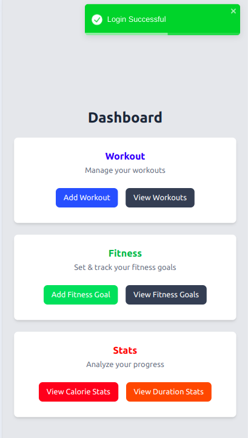
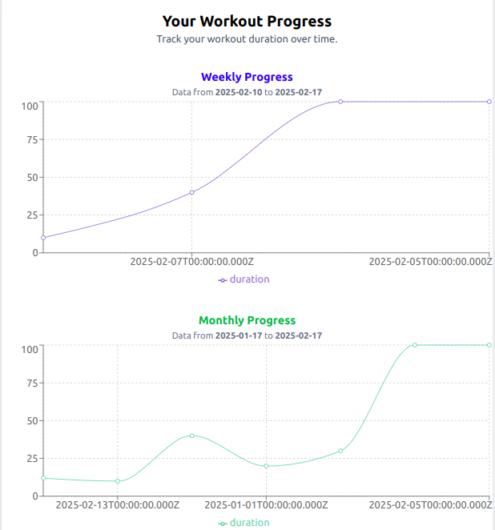
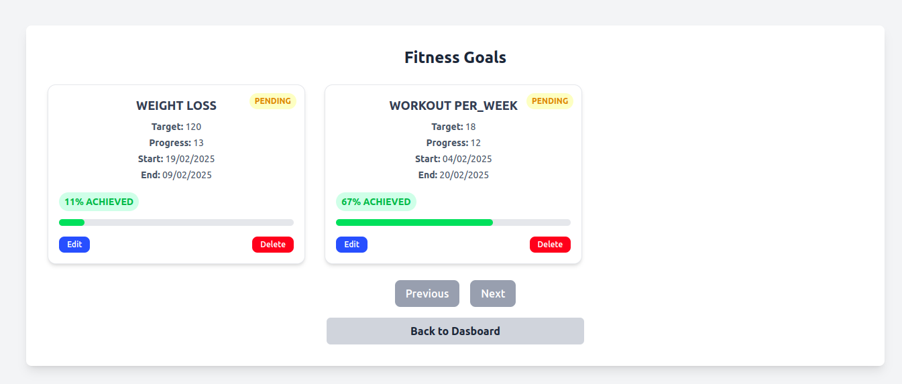

## Getting Started

To run the website locally, follow the steps below:

### Prerequisites

Make sure you have [Node.js](https://nodejs.org/) installed on your machine. You can verify your installation by running:

```bash
node -v


1)Clone the repository to your local machine:
git clone <repository-url>


2)Navigate to the project directory:
cd <project-directory>


3)Install the required dependencies:
npm install


4)To start The website 
npm run dev


About the Application
--------------------------
The Fitness Tracker is a web application designed to help users monitor and manage their fitness journey effectively. It allows users to:


Log Workouts: Record workout details such as exercise type, duration, calories burned, and date.
View & Manage Workouts: View, edit, and delete past workout entries with sorting options.
Set & Track Fitness Goals: Define personal fitness targets and monitor progress toward achieving them.
Data Visualization: Display insightful charts showing workout trends, total calories burned, and average workout duration over different time periods (weekly, monthly, yearly).
Seamless User Experience: Responsive design, smooth state management, real-time notifications using React Toastify, and global error handling ensure an intuitive and efficient experience.

Screenshots
-------------





